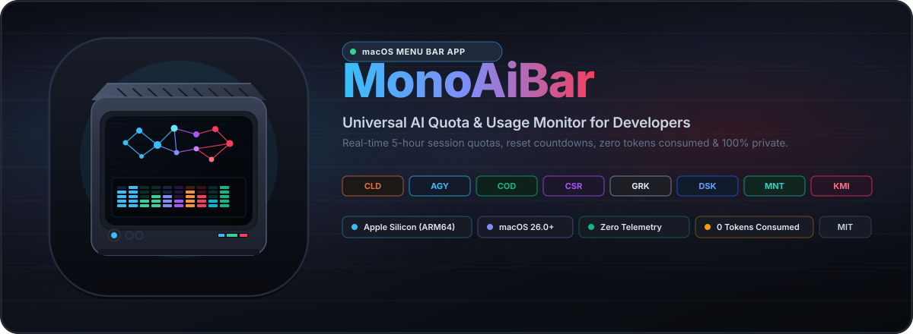
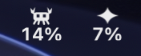
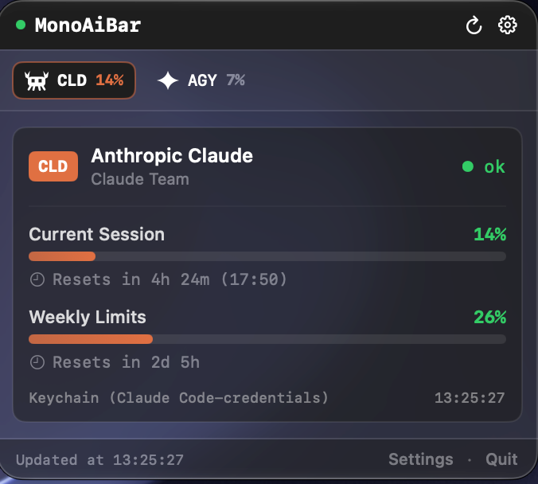
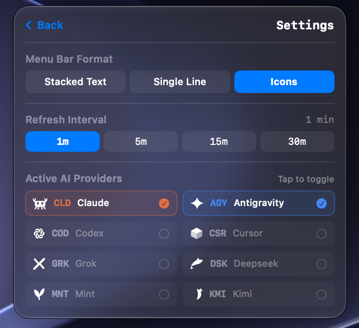

<p align="center">
  
</p>

<p align="center">
  <a href="https://github.com/JoaoOliveira889/MonoAiBar/releases"></a>
  <a href="https://github.com/JoaoOliveira889/MonoAiBar"></a>
  <a href="https://github.com/JoaoOliveira889/MonoAiBar"></a>
  <a href="https://swift.org"></a>
  <a href="LICENSE"></a>
  <a href="docs/SECURITY.md"></a>
</p>

<p align="center">
  <b>Native, ultra-lightweight real-time AI quota and usage monitor for the macOS menu bar.</b><br>
  Track usage across <b>Claude Code</b>, <b>Google Antigravity</b>, and <b>OpenAI Codex</b> with zero token cost, zero telemetry, and zero battery drain.
</p>

<p align="center">
  <a href="img/app_icon.svg"><b>View Vector App Icon (SVG)</b></a> •
  <a href="#-quick-install">Quick Install</a> •
  <a href="#-features">Features</a> •
  <a href="#-supported-providers">Supported Providers</a> •
  <a href="docs/SECURITY.md">Security Audit</a>
</p>

---

## 📸 Visual Showcase

<div align="center">

### 1. Real-Time Menu Bar Indicator



*Pixel-perfect brand marks (Clawd crab &amp; Gemini star) with live percentages and adaptive macOS dark/light template rendering.*

<br>

### 2. Quota Telemetry &amp; Interactive Settings

<table>
  <tr>
    <td align="center" width="50%">
      
      <br><br>
      <b>Detailed Quota Popover</b>
      <p><i>Active 5-hour rolling session window, weekly limits, reset countdown timers, and credential source tracking.</i></p>
    </td>
    <td align="center" width="50%">
      
      <br><br>
      <b>Preferences &amp; Provider Toggles</b>
      <p><i>3 display formats (Stacked Text, Single Line, Icons), configurable refresh intervals (1m to 30m), and 1-click provider toggles.</i></p>
    </td>
  </tr>
</table>

</div>

---

## ⚡ Key Highlights

* 🚀 **Zero Token Cost:**
  MonoAiBar **never sends prompts or performs inference**. Every metric comes from an official account telemetry endpoint or a local language server RPC, so your plan's token allowance is untouched.
* 🔑 **Keychain-Only Credential Storage:**
  Tokens and API keys live exclusively in the macOS Keychain, written with `kSecAttrAccessibleAfterFirstUnlockThisDeviceOnly` so they never sync off the device and never appear in a file or in `UserDefaults`. Claude Code's own keychain item stays the single source of truth: MonoAiBar reads it, and when it refreshes an expired OAuth pair it merges the rotated tokens straight back into that same item, leaving every field it does not model untouched.
* ✍️ **Stable Code Signature:**
  The bundle is signed with a real certificate and the hardened runtime rather than ad-hoc. A keychain grant records the signing identity of the app it was given to, so an ad-hoc signature — whose hash changes on every build — makes macOS re-prompt after each rebuild. One "Always Allow" now lasts.
* ⚡ **Subprocess-Free Language Server Discovery:**
  Antigravity's language server keeps hundreds of loopback sockets open, so scanning them is hopeless. MonoAiBar reads the server's own command line through `KERN_PROCARGS2`, takes the port block from `--host_bridge_url` and the CSRF token from `--csrf_token`, and probes a handful of ordered candidates. No `lsof`, no shelling out, no HTML scraping.
* ⏳ **Prioritized 5-Hour Session Quotas:**
  Highlights the dynamic **5-hour rolling session windows** for Claude Code and Google Antigravity with exact reset countdowns (`Resets in 4h 24m`).
* 🎨 **3 Menu Bar Display Modes:**
  1. **Stacked Text (Default):** Provider code on top, quota percentage below (`CLD 14%`, `AGY 7%`), matching native macOS system monitors.
  2. **Single Line:** Streamlined horizontal layout (`cld 14%  agy 7%`).
  3. **Icons:** Hand-crafted vector brand marks positioned pixel-perfect above the percentages.
* 👾 **Hand-Crafted Brand Icons:**
  - **Claude:** The **Clawd** pixel-art crab mascot from the Claude Code CLI.
  - **Antigravity:** Google Gemini 4-pointed sparkle star with smooth concave curves.
  - **Codex:** OpenAI 6-segment looping vortex knot.

  Each one is drawn through `NSImage(size:flipped:drawingHandler:)`, so it re-rasterises for whatever display it lands on instead of being baked at one scale.
* 🛡️ **100% Private with Zero Telemetry:**
  No external tracking, no analytics, no cookies, no intermediary servers. Credentials never leave your machine.
* 🪶 **Native Swift 6 & SwiftUI (Apple Silicon Exclusive):**
  Built for ARM64 and macOS 26+ under Swift 6 strict concurrency — providers are actors, UI state is `@Observable`, and no data race is reachable by construction. Runs as a menu bar accessory (`LSUIElement = true`) at 0% idle CPU and roughly 85 MB resident, most of which is the shared SwiftUI and AppKit runtime.

---

## 🤖 Supported Providers

| Provider | Code | Connection Method | Monitored Quota Windows |
| :--- | :---: | :--- | :--- |
| **Anthropic Claude** | `CLD` | macOS Keychain (`Claude Code-credentials`), `~/.claude/.credentials.json`, or a custom token in Settings | • 5-Hour Session Window<br>• Weekly General Limit<br>• Sonnet Specific Limit |
| **Google Antigravity** | `AGY` | Local language server RPC on `127.0.0.1`, discovered from the process command line | • Gemini 5-Hour Session<br>• Gemini Weekly Allowance<br>• Claude &amp; GPT Models |
| **OpenAI Codex** | `COD` | Settings, `~/.codex/auth.json`, or `$CODEX_ACCESS_TOKEN` / `$OPENAI_API_KEY` | • Primary Request Window |

Providers without genuine quota telemetry (such as Cursor, xAI Grok, DeepSeek, Mint, or Moonshot Kimi) are deliberately not supported. MonoAiBar never displays simulated or placeholder percentages.

For comprehensive provider configuration details, refer to [docs/PROVIDERS.md](docs/PROVIDERS.md).

---

## 💻 System Requirements

* **Operating System:** macOS 26.0 or newer.
* **Hardware:** Apple Silicon (M1, M2, M3, M4, or newer) — ARM64 only.
* **Build Toolchain:** Xcode 16+ or Xcode Command Line Tools (`xcode-select --install`).
* **Code Signing:** A `Developer ID Application` or `Apple Development` identity in your keychain. Without one the build falls back to an ad-hoc signature and macOS re-prompts for keychain access after every rebuild.
* **Swift:** Swift 6.0 or newer (Xcode 16+).

---

## 🛠️ Quick Install

### 1. Clean Atomic Installation (Recommended)

Clone the repository and run the automated installation via `Makefile`:

```bash
git clone https://github.com/JoaoOliveira889/MonoAiBar.git
cd MonoAiBar

# Builds Release mode for ARM64, creates the .app bundle, and installs to /Applications
make install
```

`make install` automatically:
1. Gracefully terminates any running instances.
2. Compiles an optimized Release binary targeting Apple Silicon (`--arch arm64`).
3. Generates the `MonoAiBar.app` bundle with the retro 80s anime icon.
4. Installs the app into `/Applications/MonoAiBar.app`.
5. Creates convenient CLI symlinks at `~/.local/bin/monoaibar` and `~/.local/bin/monobar`.
6. Refreshes macOS LaunchServices, Finder, and QuickLook caches.

### 2. Launching MonoAiBar

You can start the app via any of the following methods:

```bash
# Option A: From Terminal via CLI shortcut
monoaibar

# Option B: Using open command
open /Applications/MonoAiBar.app

# Option C: Via Spotlight
# Press Command + Space and type "MonoAiBar"
```

### 3. Useful Makefile Commands

```bash
# Compile the ARM64 release binary into .build/release/MonoAiBar
make build

# Package the executable into MonoAiBar.app
make bundle

# Launch the app directly from compiled binary
make run

# Clean local build directories and caches
make clean
```

---

## 🔒 Security & Privacy

MonoAiBar is designed with security-first architecture:

* **No Plaintext Copies:** OAuth credentials and keys are stored securely in macOS Keychain and isolated private caches with `0600` permissions. Nothing is stored in plaintext files or `UserDefaults`.
* **Read-Only Toward Other Tools:** MonoAiBar no longer writes to `~/.claude`. When it refreshes an expired token it updates the keychain item it read from and preserves every unmodelled field, so Claude Code keeps working from the same credential.
* **No Subprocesses:** Neither `/usr/bin/security` nor `/usr/sbin/lsof` is invoked. Port and process discovery use `libproc` and `sysctl` in-process, which removes the risk of a secret crossing a pipe.
* **Ephemeral Network Connections:** Outbound queries use `URLSessionConfiguration.ephemeral` with cookies refused and no URL cache. Responses are size-capped before decoding.
* **Localhost Loopback Isolation:** Antigravity RPC targets are constructed as `http://127.0.0.1:<port>` from a validated port number and can never point off-machine.
* **Privacy-Aware Logging:** Diagnostics go to `OSLog`. No log statement takes a token, and no `print` call remains in the codebase.
* **Zero Telemetry:** No analytics packages, no user identifiers, no inspection of your source files.

For the full security audit report, see [docs/SECURITY.md](docs/SECURITY.md).

---

## 📚 Technical Documentation

* 🏛️ **[System Architecture](docs/ARCHITECTURE.md):** CoreGraphics dynamic rendering pipeline, concurrency model, and macOS 26+ AppKit integration.
* 🛡️ **[Security & Privacy Audit](docs/SECURITY.md):** Formal audit results, token lifecycles, and subprocess sandboxing.
* 🤖 **[Provider Setup Guide](docs/PROVIDERS.md):** Step-by-step instructions for connecting the three supported AI providers.
* 🎨 **[App Icon Vector (SVG)](img/app_icon.svg):** Standalone scalable 80s anime flat CRT icon.

---

## 📄 License

This project is free open-source software released under the **[MIT License](LICENSE)**.

---

<p align="center">
  Crafted with ☕ and Swift by <b>João Oliveira</b>
</p>
